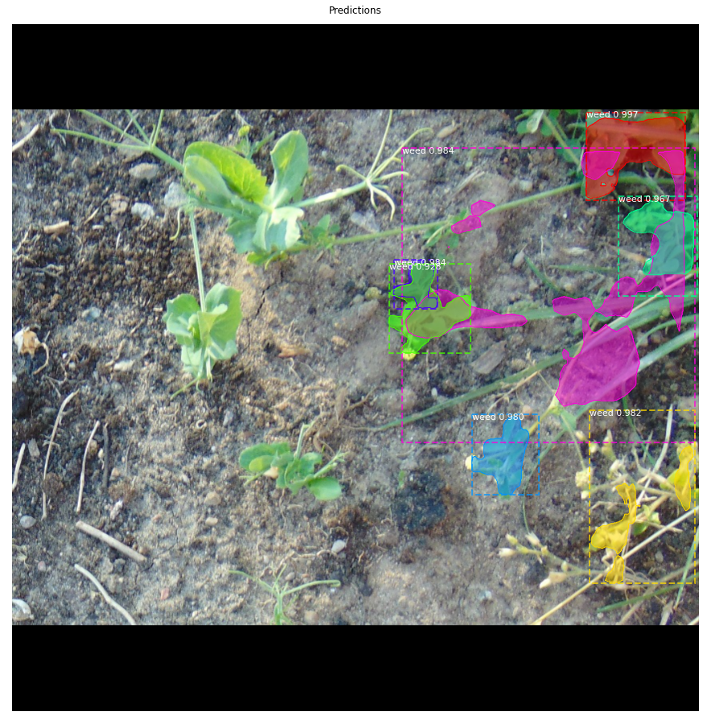

# Weed Detection using MaskRCNN
A model based on transfer leaning to classify weeds from other plants and soil.This model does instace segmentaion which give pixel level accuracy.So it can be deployed with a camera attached to UAV's and ground based robots to spray pesticides with pin point accuracy
Here is an example:

### Dataset Building
Since we are going to train an instance segmentation model that should have pixel level accuracy it's important to annotate the 
images properly we have used [VGG Image Annotator](http://www.robots.ox.ac.uk/~vgg/software/via/) tool for this purpose.

### Model Weights and Tensorboard Logs
[Pre-trained weight](https://drive.google.com/file/d/11XssW0dkMGfxsFWM-zp_DxICXsLqnGtf/view?usp=sharing)

[Tensorboard Logs](https://drive.google.com/file/d/1fJsdFJwFsfmwLA6Yy3TZVB4pOTVRa1F6/view?usp=sharing)

inspect_weed_data.ipynb  ---- This notebook visualizes the different pre-processing steps to prepare the training data.
weed_detection1.ipynb    ---- This notebook goes in depth into the steps performed to detect and segment objects. It provides          visualizations of every step of the pipeline.
### Citation
+ [MaskRCNN Paper](https://arxiv.org/pdf/1703.06870.pdf)
+ [Mask_RCNN GitHub](https://github.com/matterport/Mask_RCNN)
+ [FasterRCNN Paper](https://arxiv.org/pdf/1504.08083.pdf)
