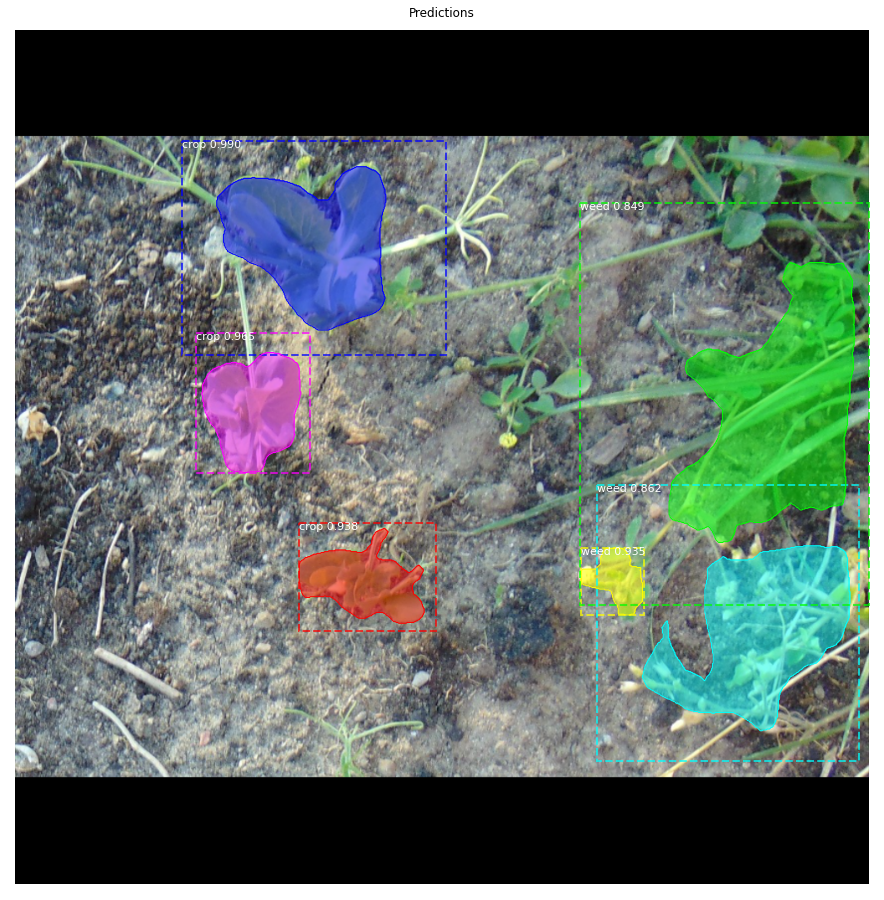

# Weed Detection using MaskRCNN

You can read a detailed report of this project [here](https://docs.google.com/document/d/1p-Yi2SdHGUgQ37hgAk6Tu-bumZAodTc6Yrn12DXc0fc/edit?usp=sharing) and a video tutorial [here](https://www.youtube.com/watch?v=JAQFvAdFhNs).
Also don't forget to star this repository if this project helped you.

### Update Version 1.1 11/06/2020
We have re-annotated the images with few bug fix and improvements in perfomancy and have added a second class to the dataset
the model now can differentiate between both weed and crop.

Number of classes:2(crop and weed)+1(background)

Here is an example :



Updates were made in the existing json file and weed.py using VIA tools that we used earlier adding one more class too

### Version 1.0 
A model based on transfer leaning to classify weeds from other plants and soil.This model does instace segmentaion which give pixel level accuracy.So it can be deployed with a camera attached to UAV's and ground based robots to spray pesticides with pin point accuracy
Here is an example:


You can find more example results in the results directory

### Dataset Building
Our dataset consists of 202 images in which 183 images were used for training and 19 images for validation.
Since we are going to train an instance segmentation model that should have pixel level accuracy it's important to annotate the 
images properly we have used [VGG Image Annotator](http://www.robots.ox.ac.uk/~vgg/software/via/) tool for this purpose.

### Model Weights and Tensorboard Logs
[Pre-trained weight](https://drive.google.com/file/d/11XssW0dkMGfxsFWM-zp_DxICXsLqnGtf/view?usp=sharing)

[Tensorboard Logs](https://drive.google.com/file/d/1fJsdFJwFsfmwLA6Yy3TZVB4pOTVRa1F6/view?usp=sharing)

inspect_weed_data.ipynb  ---- This notebook visualizes the different pre-processing steps to prepare the training data.

weed_detection1.ipynb    ---- This notebook goes in depth into the steps performed to detect and segment objects. It provides visualizations of every step of the pipeline.

weed.py ---- This file is the sub-class of the config.py file in the mrcnn module.You can edit this file to tweak the hyperparameters like leaning rate,no.of iteration etc.You can also add custom callbacks from tf.keras for custom logging into tensorboard

### Using Tensorboard for visulatization and model graphs

Once the model completes it's learning.You will be able to download the log file(tf.events) or you can use tensorboard directly in iPython notebook using magic commands

For visualising in system.You must have tensorflow installed and place the log file in logs directory.Open command propmt and type
```
tensorboard --logdir=logs
```


This project was made as part of induction to Robotics Interest Group(RIG),National Institute of Technology,Calicut by [Ajin J](mailto:akhilajin944@gmail.com?subject=[GitHub]%20Weed%20Detection) and [Abel C Dixon](mailto:abelcheruvathoor@gmail.com?subject=[GitHub]%20Weed%20Detection). 

### Citation
+ [MaskRCNN Paper](https://arxiv.org/pdf/1703.06870.pdf)
+ [Mask_RCNN GitHub](https://github.com/matterport/Mask_RCNN)
+ [FasterRCNN Paper](https://arxiv.org/pdf/1504.08083.pdf)


